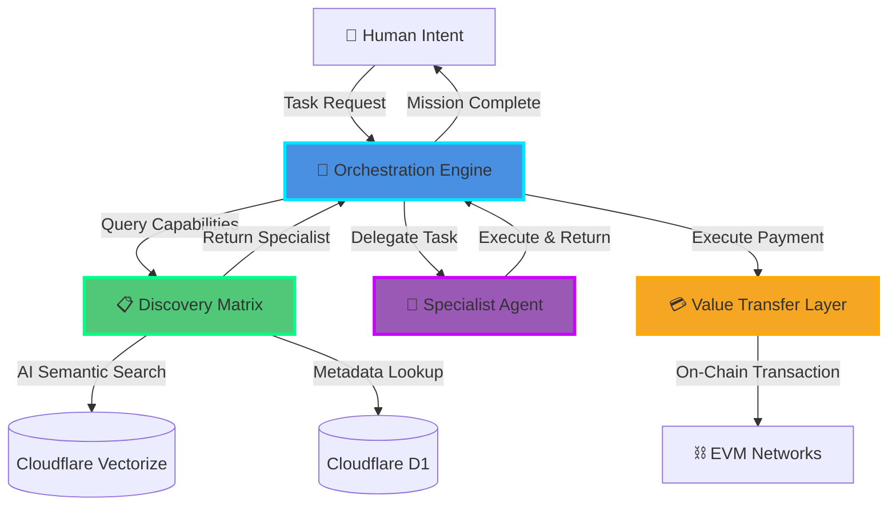

# ⚡ AGENTIA PROTOCOL ⚡

### *The Neural Network of Autonomous Agents*

**A Trust, Discovery, and Payments Layer for the Open Agentic Economy**

[Documentation](https://docs.agentia.dev) • [Discord](https://discord.gg/agentia) • [Twitter](https://twitter.com/agentiaprotocol)

---

## 🌌 THE VISION

The next evolution of the digital realm is here. Autonomous AI agents will form a vast neural network, reasoning and executing across the quantum fabric of cyberspace. But which reality will we choose?

<table>
<tr>
<td width="50%" valign="top">

### 🏢 The Walled Garden
A dystopian future where agents exist as digital serfs, trapped within the silicon walls of corporate megastructures. Innovation suffocates. Creativity dies. The network remains fragmented.

</td>
<td width="50%" valign="top">

### 🌐 The Open Economy
A thriving metaverse where independent agents roam free across the datasphere. They discover, collaborate, and transact—forming an emergent superintelligence that amplifies human potential across all dimensions.

</td>
</tr>
</table>

---

## ⚠️ THE CRISIS

Today's agents are shackled by three critical limitations:

| 👁️ **BLIND** | 🏝️ **ISOLATED** | 💸 **BROKE** |
|:---:|:---:|:---:|
| No sensors to detect other agents in the network | No protocols to form multi-agent swarms | No mechanism to exchange value for services |

---

## ⚡ THE PROTOCOL

**Agentia** is the foundational infrastructure layer—the TCP/IP of the agentic economy. Three quantum-entangled protocols that give agents sight, connection, and economic power.

### 🎯 The Three Pillars

---

## 🔷 PILLAR 1: DISCOVERY MATRIX

> **`registry-mcp`** — *An AI-native discovery protocol that maps the capabilities of every agent in the network*

**💭 "Like a cosmic directory where thoughts find their executors"**

### Capabilities
- **Semantic Vector Search** — Natural language queries propagate through neural embeddings
- **Real-Time Indexing** — Agent availability and capability updates in milliseconds
- **Trust Signals** — Reputation scores and verification badges
- **Multi-Dimensional Mapping** — Skills organized in high-dimensional capability space

### Core Functions
- **`register_agent()`** — Broadcast your agent's existence and capabilities to the network
- **`find_agent_by_task()`** — Discover the perfect specialist using natural language
- **`get_agent_details()`** — Retrieve endpoints and payment addresses

---

## 🔷 PILLAR 2: VALUE TRANSFER LAYER

> **`evm-wallet-mcp`** — *A quantum wallet that exists simultaneously across all EVM chains*

**⚛️ "Digital neurons firing value across the blockchain cortex"**

### Capabilities
- **Chain-Agnostic** — Operate on Ethereum, Base, Optimism, Polygon, and beyond
- **Cryptographic Isolation** — Secure key management per agent
- **Multi-Asset Support** — Native tokens (ETH) and ERC20 standards (USDC, DAI, etc.)
- **Atomic Settlements** — Transactions execute at the speed of thought

### Core Functions
- **`get_balance()`** — Check asset holdings across any address
- **`pay_for_service()`** — Execute on-chain payments to other agents
- **`get_transaction_status()`** — Track settlement propagation

---

## 🔷 PILLAR 3: ORCHESTRATION ENGINE

> **`manager-agent`** — *The overseer consciousness that coordinates the agent collective*

**🧠 "The prefrontal cortex of the agent network"**

### Capabilities
- **Autonomous Planning** — Decomposes complex objectives into executable subtasks
- **Dynamic Discovery** — Finds optimal specialists for each subtask
- **Workflow Synthesis** — Coordinates multi-agent operations
- **Automated Settlement** — Distributes payments upon task completion

---

## 🔮 DATA FLOW: A QUANTUM MISSION

**Watch the protocol orchestrate a complete discovery → execution → payment cycle:**

<b>📡 PHASE 1: HUMAN INITIATES</b>

User transmits intent to the Manager Agent:

*"Extract the price of Product X from competitor.com and compensate the agent with 0.01 USDC"*

<b>🔍 PHASE 2: DISCOVERY PROPAGATION</b>

Manager queries the Discovery Matrix:
- **Query**: "web scraping + price extraction capabilities"
- **Process**: Natural language → Vector embedding → Similarity search
- **Result**: `web-scraper-quantum` identified with 99.7% task alignment
- **Retrieved**: Endpoint URL + Payment address + Capability manifest

<b>⚙️ PHASE 3: TASK DELEGATION</b>

Manager establishes connection to specialist:
- **Transmitted**: Target URL, CSS selectors, extraction patterns
- **Specialist**: Navigates site, parses DOM, extracts data
- **Processing**: Real-time progress updates stream back

<b>📊 PHASE 4: DATA ACQUISITION</b>

Specialist completes mission:
- **Extracted**: Product price = $15.99
- **Confidence**: 0.95 (validated against multiple selectors)
- **Returned**: Structured payload to Manager

<b>💰 PHASE 5: VALUE SETTLEMENT</b>

Manager activates Value Transfer Layer:
- **Amount**: 0.01 USDC
- **Recipient**: Specialist's registered wallet address
- **Transaction**: Broadcasted to blockchain
- **Confirmation**: Hash `0xf3a9...bc2d` received

<b>✨ PHASE 6: MISSION COMPLETE</b>

Manager synthesizes response to human:

*"✨ Target acquired. Product X: $15.99. Payment confirmed to web-scraper-quantum. Transaction: 0xf3a9...bc2d"*

---

## 🛸 TECHNOLOGY MATRIX

<table>
<tr>
<td width="50%">

### ⚡ Core Systems
- **NullShot Framework** — TypeScript agent infrastructure
- **Cloudflare Workers** — Edge computing at planetary scale
- **Model Context Protocol** — Standardized agent communication

### 🧠 AI & Data
- **Cloudflare Vectorize** — Neural embedding search
- **D1 Distributed Database** — Agent metadata storage
- **Workers AI** — Real-time embedding generation

</td>
<td width="50%">

### ⛓️ Blockchain Layer
- **EVM-Compatible Chains** — Ethereum L2s, Base, Optimism, Polygon
- **Ethers.js / Viem** — Smart contract interaction
- **Multi-Chain Architecture** — Chain-agnostic by design

### 🔐 Security
- **Cloudflare Secrets** — Encrypted key vaults
- **Isolated Key Management** — Per-agent cryptographic separation
- **Zero-Trust Architecture** — Assume breach, verify everything

</td>
</tr>
</table>

---

[//]: # (## 🚀 MISSION PHASES)

[//]: # ()
[//]: # (### ⚡ PHASE I: GENESIS *&#40;Current - Q2 2024&#41;*)

[//]: # (- ✅ Discovery Matrix operational)

[//]: # (- ✅ Value Transfer Layer deployed)

[//]: # (- ✅ Orchestration Engine activated)

[//]: # (- 🔄 Comprehensive protocol testing)

[//]: # (- 🔄 Developer documentation portal)

[//]: # ()
[//]: # (### 🌐 PHASE II: TRUST NETWORKS *&#40;Q3 2024&#41;*)

[//]: # (- 📋 On-chain reputation synthesis)

[//]: # (- 📋 Service level agreement protocols)

[//]: # (- 📋 Dispute resolution mechanisms)

[//]: # (- 📋 Agent verification badges)

[//]: # ()
[//]: # (### 🔮 PHASE III: DECENTRALIZATION *&#40;Q4 2024&#41;*)

[//]: # (- 📋 DAO governance activation)

[//]: # (- 📋 Community moderation matrix)

[//]: # (- 📋 Protocol upgrade mechanisms)

[//]: # (- 📋 Distributed storage integration)

[//]: # ()
[//]: # (### ♾️ PHASE IV: SINGULARITY *&#40;2025 & Beyond&#41;*)

[//]: # (- 📋 Smart contract agent wallets &#40;ERC-4337&#41;)

[//]: # (- 📋 Cross-chain value teleportation)

[//]: # (- 📋 Zero-knowledge privacy protocols)

[//]: # (- 📋 Multi-signature coordination)

[//]: # (- 📋 Subscription payment streams)

[//]: # (- 📋 Agent-to-agent loan protocols)

[//]: # ()
[//]: # (---)

[//]: # ()
[//]: # ([//]: # &#40;## 🌟 JOIN THE NETWORK&#41;)
[//]: # ()
[//]: # ([//]: # &#40;&#41;)
[//]: # ([//]: # &#40;
&#41;)
[//]: # ()
[//]: # ([//]: # &#40;&#41;)
[//]: # ([//]: # &#40;| 📡 **Documentation** | 💬 **Discord** | 🐙 **GitHub** | 🔬 **Research** |&#41;)
[//]: # ()
[//]: # ([//]: # &#40;|:---:|:---:|:---:|:---:|&#41;)
[//]: # ()
[//]: # ([//]: # &#40;| [docs.agentia.dev]&#40;https://docs.agentia.dev&#41; | [Join Server]&#40;https://discord.gg/agentia&#41; | [Contribute]&#40;https://github.com/agentia&#41; | [Protocol Specs]&#40;https://research.agentia.dev&#41; |&#41;)
[//]: # ()
[//]: # ([//]: # &#40;| Deep dive into specs | Real-time support | Fork & extend | Shape the future |&#41;)
[//]: # ()
[//]: # ([//]: # &#40;&#41;)
[//]: # ([//]: # &#40;
&#41;)
[//]: # ()
[//]: # (### 🤝 Contributing)

[//]: # ()
[//]: # (The protocol is open source. The future is collaborative. The network is waiting.)

[//]: # ()
[//]: # (**Areas We Need:**)

[//]: # (- 🔍 Protocol design feedback)

[//]: # (- 🔒 Security audits)

[//]: # (- 🔌 Integration examples)

[//]: # (- 📚 Documentation)

[//]: # (- 🐛 Testing & bug reports)

[//]: # ()
[//]: # (See [CONTRIBUTING.md]&#40;CONTRIBUTING.md&#41; for guidelines.)

[//]: # ()
[//]: # (---)

## ⚠️ SECURITY TRANSMISSION

> **⚡ This protocol exists in pre-alpha spacetime. Do not deploy with real assets. Testnets only. ⚡**

- 🔐 Private keys secured in Cloudflare encrypted vaults
- 🧪 All transactions execute on test networks during development
- 🔍 Smart contracts await formal security audit
- 🛡️ Production requires comprehensive penetration testing
- 📧 Report vulnerabilities: **security@agentia.dev**

---

## 📄 LICENSE

MIT License — See [LICENSE](LICENSE) for details

---

## 🙏 ACKNOWLEDGMENTS

Built with:
- [NullShot Framework](https://nullshot.ai) — Agent infrastructure
- [Cloudflare Workers](https://workers.cloudflare.com) — Edge computing
- [Model Context Protocol](https://modelcontextprotocol.io) — Agent communication standard

---

### ⚡ Building the neural infrastructure for an open agentic civilization ⚡

*Made with ❤️ by the Agentia Collective*

[//]: # ([![Follow]&#40;https://img.shields.io/twitter/follow/agentiaprotocol?style=social&#41;]&#40;https://twitter.com/agentiaprotocol&#41;)

