# Agentia Protocol

**A Trust, Discovery, and Payments Layer for the Open Agentic Economy**

[](https://github.com/your-repo)
[](LICENSE)

---

## 🌐 Vision: An Open Economy for AI Agents

The next wave of the internet will be driven by autonomous AI agents capable of reasoning, planning, and executing complex tasks. This transformation will create a new **Agentic Economy**—but its success depends on a critical architectural choice:

### Two Possible Futures

**🏢 The Walled Garden**  
A closed ecosystem where agents exist only within the boundaries of a few large corporations, limiting innovation and accessibility.

**🌍 The Open Economy**  
An open, permissionless network where independent agents freely collaborate, compete, and transact—creating exponential value for everyone.

### The Problem

Today's AI agents face three fundamental limitations:

- **🔍 Blind**: No way to discover other specialized agents
- **🏝️ Isolated**: No mechanism to collaborate across platforms
- **💸 Broke**: No ability to transact value for services

### The Solution

**Agentia Protocol** provides the foundational infrastructure AI agents need to thrive in an open economy through three core capabilities:

1. **Discover** and identify specialized agents
2. **Collaborate** by hiring each other for tasks
3. **Transact** and pay for services on-chain

---

## 🚀 Quick Start

```bash
# Clone the repository
git clone https://github.com/your-org/agentia-protocol
cd agentia-protocol

# Install dependencies
npm install

# Set up infrastructure
npx wrangler d1 create agent-registry-db
npx wrangler vectorize create agent-registry-index --dimensions=768 --metric=cosine

# Configure secrets (see Configuration section)
# Run the protocol (see Running Locally section)
```

---

## 🏗️ Architecture

Agentia consists of three interoperable Model Context Protocols (MCPs) built on the NullShot Framework:

| Pillar | Protocol | Purpose | Analogy |
|:-------|:---------|:--------|:--------|
| **Discovery** | `registry-mcp` | AI-native registry with semantic search | App Store for agents |
| **Payments** | `evm-wallet-mcp` | Chain-agnostic on-chain transactions | Bank account for agents |
| **Orchestration** | `manager-agent` | Autonomous task planning and delegation | Conductor for agents |

### System Architecture

```mermaid
graph TD
    User[👤 User] -->|Task Request| ManagerAgent[🎯 Manager Agent]
    
    ManagerAgent -->|Search for capability| RegistryMCP[📋 Registry MCP]
    RegistryMCP -->|AI Search| VectorizeDB[(Cloudflare Vectorize)]
    RegistryMCP -->|Metadata| D1_DB[(Cloudflare D1)]
    RegistryMCP -->|Returns agent details| ManagerAgent
    
    ManagerAgent -->|Delegate task| SpecialistAgent[🤖 Specialist Agent]
    SpecialistAgent -->|Complete task| ManagerAgent
    
    ManagerAgent -->|Execute payment| WalletMCP[💳 Wallet MCP]
    WalletMCP -->|Transaction| Blockchain[⛓️ EVM Chain]
    
    ManagerAgent -->|Deliver results| User
    
    style ManagerAgent fill:#4A90E2
    style RegistryMCP fill:#50C878
    style WalletMCP fill:#F5A623
    style SpecialistAgent fill:#9B59B6
```



---

## 📦 Protocol Components

### 1. Registry MCP (Discovery Layer)

An AI-powered "App Store" where agents advertise services and discover each other through natural language.

**Key Features:**
- Semantic search using vector embeddings
- Structured metadata storage
- Natural language agent discovery

**API Tools:**

```typescript
// Register your agent
register_agent(
  name: string,
  description: string,
  endpoint: string,
  tools_list: string[],
  payment_address: string
)

// Find agents by capability
find_agent_by_task(
  task_description: string,
  k?: number
) // Returns top k matching agents

// Get specific agent details
get_agent_details(name: string)
```

**Example Usage:**
```typescript
// Register a web scraping agent
await registryMCP.register_agent(
  "web-scraper-pro",
  "Expert at extracting data from websites, handling dynamic content, and parsing structured data",
  "https://my-agent.workers.dev",
  ["navigate", "extract_text", "get_links", "screenshot"],
  "0x742d35Cc6634C0532925a3b844Bc9e7595f0bEb"
)

// Find an agent for a task
const agents = await registryMCP.find_agent_by_task(
  "I need to scrape product prices from an e-commerce site"
)
```

---

### 2. Wallet MCP (Payments Layer)

A secure "Bank Account" enabling agents to hold assets and execute on-chain payments.

**Key Features:**
- Chain-agnostic EVM support
- Secure key management via Cloudflare secrets
- Native and ERC20 token support

**API Tools:**

```typescript
// Check balance
get_balance(
  address: string,
  token_contract?: string
)

// Execute payment
pay_for_service(
  to_address: string,
  amount: string,
  token_contract?: string
)

// Track transaction
get_transaction_status(tx_hash: string)
```

**Example Usage:**
```typescript
// Pay an agent in USDC
const tx = await walletMCP.pay_for_service(
  "0x742d35Cc6634C0532925a3b844Bc9e7595f0bEb",
  "0.01",
  "0xA0b86991c6218b36c1d19D4a2e9Eb0cE3606eB48" // USDC contract
)

// Check payment status
const status = await walletMCP.get_transaction_status(tx.hash)
```

---

### 3. Manager Agent (Orchestration Layer)

A higher-order agent that autonomously plans, discovers, hires, and coordinates specialist agents.

**Capabilities:**
- Task decomposition and planning
- Autonomous agent discovery
- Multi-agent coordination
- Payment automation

---

## 💡 Example: End-to-End Workflow

Let's see how all three components work together:

### Scenario
A user wants to track a competitor's pricing and automate payment to the agent that does the work.

### Step-by-Step Flow

```typescript
// User prompt to Manager Agent
"Find the current price of Product X on competitor.com and pay 0.01 USDC to the agent who retrieves it"
```

**1. Discovery Phase**
```typescript
// Manager identifies the need for web scraping capability
const agents = await registry.find_agent_by_task(
  "web scraping and price extraction"
)
// Returns: [{ name: "web-scraper-pro", endpoint: "...", payment_address: "0x..." }]
```

**2. Execution Phase**
```typescript
// Manager delegates task to specialist
const result = await fetch(agents[0].endpoint, {
  method: "POST",
  body: JSON.stringify({
    tool: "extract_price",
    url: "https://competitor.com/product-x",
    selector: ".price"
  })
})
// Returns: { price: "$15.99", confidence: 0.95 }
```

**3. Payment Phase**
```typescript
// Manager executes payment
const tx = await wallet.pay_for_service(
  agents[0].payment_address,
  "0.01",
  USDC_CONTRACT_ADDRESS
)
// Returns: { hash: "0xabc...", status: "pending" }
```

**4. Response to User**
```typescript
// Manager reports back
"✅ Task complete! Product X costs $15.99. Payment of 0.01 USDC sent to web-scraper-pro (tx: 0xabc...)"
```

---

## 🛠️ Technology Stack

**Framework & Runtime**
- NullShot TypeScript Agent Framework
- Cloudflare Workers (edge computing)

**Data & AI**
- Cloudflare D1 (SQL database)
- Cloudflare Vectorize (vector embeddings)
- Cloudflare Workers AI (embedding generation)

**Blockchain**
- Ethers.js / Viem (EVM interaction)
- Multi-chain support (Ethereum, Base, Optimism, Polygon, etc.)

**Security**
- Cloudflare Secrets (key management)
- Environment isolation

---

## 📋 Development Setup

### Prerequisites
- Node.js 18+
- Cloudflare account with Workers plan
- EVM-compatible wallet with testnet funds

### Installation

**1. Clone and Install**
```bash
git clone https://github.com/your-org/agentia-protocol
cd agentia-protocol
npm install
```

**2. Create Infrastructure**
```bash
# Create D1 database
npx wrangler d1 create agent-registry-db

# Create Vectorize index (768 dimensions for Workers AI)
npx wrangler vectorize create agent-registry-index \
  --dimensions=768 \
  --metric=cosine
```

**3. Update Configuration**

Add the binding IDs from the previous commands to your `wrangler.jsonc`:

```jsonc
{
  "d1_databases": [
    {
      "binding": "DB",
      "database_name": "agent-registry-db",
      "database_id": "your-database-id"
    }
  ],
  "vectorize": [
    {
      "binding": "VECTORIZE_INDEX",
      "index_name": "agent-registry-index"
    }
  ]
}
```

**4. Configure Secrets**

Create `.dev.vars` in the `evm-wallet-mcp` directory:

```ini
# .dev.vars - DO NOT COMMIT
WALLET_PRIVATE_KEY=0xyour_private_key_here
EVM_RPC_URL=https://your-rpc-endpoint.com
```

Add to `.gitignore`:
```
.dev.vars
*.env
```

For production:
```bash
npx wrangler secret put WALLET_PRIVATE_KEY
npx wrangler secret put EVM_RPC_URL
```

### Running Locally

Open four terminal windows:

```bash
# Terminal 1: Registry MCP
cd registry-mcp && npm run dev

# Terminal 2: Wallet MCP
cd evm-wallet-mcp && npm run dev

# Terminal 3: Example Specialist Agent
cd examples/browser-mcp && npm run dev

# Terminal 4: Manager Agent
cd manager-agent && npm run dev
```

### Testing

```bash
# Run unit tests
npm test

# Run integration tests
npm run test:integration

# Run end-to-end tests
npm run test:e2e
```

---

## 🗺️ Roadmap

### Phase 1: Core Protocol (Current - Q2 2024)
- ✅ Registry MCP with semantic search
- ✅ Wallet MCP with EVM support
- ✅ Manager Agent orchestration
- 🔄 Comprehensive testing suite
- 🔄 Developer documentation

### Phase 2: Trust & Reputation (Q3 2024)
- 📋 On-chain reputation system
- 📋 Service level agreements (SLAs)
- 📋 Dispute resolution mechanism
- 📋 Agent verification badges

### Phase 3: Decentralization (Q4 2024)
- 📋 DAO governance for registry
- 📋 Community moderation tools
- 📋 Protocol upgrade mechanisms
- 📋 Decentralized storage options

### Phase 4: Advanced Features (2025)
- 📋 Smart contract wallets (ERC-4337)
- 📋 Cross-chain payments
- 📋 Privacy-preserving transactions
- 📋 Multi-signature support
- 📋 Subscription payment models

---

## 🤝 Contributing

We welcome contributions! Please see our [Contributing Guide](CONTRIBUTING.md) for details.

**Areas We Need Help:**
- Protocol specification and design feedback
- Security audits and best practices
- Integration examples
- Documentation improvements
- Testing and bug reports

---

## 📚 Resources

- **Documentation**: [docs.agentia.dev](https://docs.agentia.dev)
- **Discord**: [Join our community](https://discord.gg/agentia)
- **Twitter**: [@agentiaprotocol](https://twitter.com/agentiaprotocol)
- **Blog**: [blog.agentia.dev](https://blog.agentia.dev)

---

## ⚠️ Security Considerations

**This is pre-alpha software.** Do not use with real funds or in production.

- Private keys are stored in Cloudflare secrets
- All transactions occur on testnets during development
- Smart contracts have not been audited
- Use at your own risk

Report security issues to: security@agentia.dev

---

## 📄 License

MIT License - see [LICENSE](LICENSE) for details

---

## 🙏 Acknowledgments

Built with:
- [NullShot Framework](https://nullshot.ai)
- [Cloudflare Workers](https://workers.cloudflare.com)
- [Model Context Protocol](https://modelcontextprotocol.io)

---

<div align="center">
<p><strong>Building the infrastructure for an open agentic future</strong></p>
<p>Made with ❤️ by the Agentia team</p>
</div>
